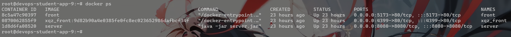

# 2023秋DevOps课程第2次实践作业报告

<center>第9组 LoveDevOps</center>


| 角色  | 姓名 | 学号 | QQ号 | 职责 |
| ----- | ---- | ---- | ---- | ---- |
| 组长  |赵政杰|211250109|3239168744| 网页端部署、前后端代码依赖检查    |
| 组员2 |谢其卓|211870187|1055069518| 前后端静态安全检查、网页端代码自动格式化    |
| 组员3 |陈盛  |211250104|749810747| 部署服务器环境设置、前后端构建与代码质量检查    |
| 组员4 |谷雨阳|211250108|1198890085| runner环境设置、服务端测试与质量门禁及部署   |

[前端部署地址](http://172.29.4.118:5173/)

## 承载平台

runner与部署服务器均为**南软云**，数据库服务器为**华为云**


## 项目功能

部署的项目来自软工二的大作业，该项目是一个类似12306的平台。用户可以在平台上进行**注册、登录、购票**等


## 服务端项目

### 构建与测试（单元测试）

#### 执行记录链接

[服务端-构建与测试：Pipeline页面链接](https://git.nju.edu.cn/9_2023_fall_devops/9_2023_fall_devops_server/-/pipelines/78614)

[服务端-构建与测试：build-job页面链接](https://git.nju.edu.cn/9_2023_fall_devops/9_2023_fall_devops_server/-/jobs/140455)

[服务端-构建与测试：unit-test-job页面链接](https://git.nju.edu.cn/9_2023_fall_devops/9_2023_fall_devops_server/-/jobs/140462)

#### 加分项

##### 单元测试报告整合到网页端

在流水线中的`unit-test-job`中添加如下内容，以展示单元测试报告与覆盖率报告：

```yaml
coverage: '/    - Instruction Coverage: ([0-9.]+)%/'
artifacts:
when: always
reports:
    junit: build/test-results/test/**/TEST-*.xml
paths:
    - build/reports/jacoco/test/html/
    - build/reports/jacoco/test/jacocoTestReport.xml
```

[服务端-构建与测试：测试报告网页端链接](https://git.nju.edu.cn/9_2023_fall_devops/9_2023_fall_devops_server/-/pipelines/78614/test_report)

##### 提供覆盖率报告

[服务端-构建与测试：覆盖率报告链接](https://git.nju.edu.cn/9_2023_fall_devops/9_2023_fall_devops_server/-/jobs/151846)

在code-quality中点击download下载


下载的artifacts, 里面相应位置有report


同时覆盖率也会在readme和项目标题显示


在merge request里面, 也会进行对比


[Code coverage statistics for **master**](https://git.nju.edu.cn/9_2023_fall_devops/9_2023_fall_devops_server/-/graphs/master/charts)

覆盖率也会被统计到Repository Analytics里面


### 代码质量检查

#### 执行记录链接

[服务端-代码质量检查：Pipeline页面链接](https://git.nju.edu.cn/9_2023_fall_devops/9_2023_fall_devops_server/-/pipelines/78614)

[服务端-代码质量检查：code-quality页面链接](https://git.nju.edu.cn/9_2023_fall_devops/9_2023_fall_devops_server/-/pipelines/78614/codequality_report)

#### 加分项

##### 检测出除了TODO以外的代码质量问题

实现方式:

使用了在手册基础之上[.codeclimate.yml](https://git.nju.edu.cn/9_2023_fall_devops/9_2023_fall_devops_server/-/blob/master/.codeclimate.yml?ref_type=heads),制定了规则

[服务端-代码质量检查：其他代码质量问题链接-有问题的流水线](https://git.nju.edu.cn/9_2023_fall_devops/9_2023_fall_devops_server/-/pipelines/77244/codequality_report)

出Todo之外还出现了其他的错误:错误的原因是main方法的方法函数过多


### 代码质量门禁

#### 执行记录链接

> 需要提供对应PR，对应 Pipeline 的页面链接以及其构建阶段对应的 job 的页面链接。


[服务端-代码质量门禁：PR页面链接](https://git.nju.edu.cn/9_2023_fall_devops/9_2023_fall_devops_server/-/merge_requests/5)

[服务端-代码质量门禁：Pipeline页面链接](https://git.nju.edu.cn/9_2023_fall_devops/9_2023_fall_devops_server/-/pipelines/78276)

[服务端-代码质量门禁：code-quality页面链接](https://git.nju.edu.cn/9_2023_fall_devops/9_2023_fall_devops_server/-/jobs/138508)

#### 加分项

无

### 代码依赖检查与静态安全检查

#### 执行记录链接

[服务端-代码依赖检查与静态安全检查：Pipeline页面链接](https://git.nju.edu.cn/9_2023_fall_devops/9_2023_fall_devops_server/-/pipelines/77992)

[服务端-代码依赖检查与静态安全检查：dependency_scanning页面链接](https://git.nju.edu.cn/9_2023_fall_devops/9_2023_fall_devops_server/-/pipelines/77992/security?reportType=DEPENDENCY_SCANNING)

[服务端-代码依赖检查与静态安全检查：semgrep-sast页面链接](https://git.nju.edu.cn/9_2023_fall_devops/9_2023_fall_devops_server/-/pipelines/77992/security?reportType=SAST)

#### 加分项

##### 静态安全检查能检测出具体的问题并展示修复过程

[服务端-代码依赖检查与静态安全检查：具体问题链接](https://git.nju.edu.cn/9_2023_fall_devops/9_2023_fall_devops_server/-/pipelines/77992/security?reportType=SAST)


检测出可能会出现sql注入问题

之前


删除这个代码

[问题消失](https://git.nju.edu.cn/9_2023_fall_devops/9_2023_fall_devops_server/-/pipelines/80620/security)


### 项目部署

#### 执行记录链接

[服务端-项目部署：Pipeline页面链接](https://git.nju.edu.cn/9_2023_fall_devops/9_2023_fall_devops_server/-/pipelines/78614/)

[服务端-项目部署：deploy-job页面链接](https://git.nju.edu.cn/9_2023_fall_devops/9_2023_fall_devops_server/-/jobs/140466)

#### 加分项

##### 使用Docker进行部署




##### yaml中不出现具体凭据

通过设定gitlab的设置中的变量，在流水线中引用变量而不出现具体凭据


## 网页端项目

### 构建

#### 执行记录链接

[网页端-构建：Pipeline页面链接](https://git.nju.edu.cn/9_2023_fall_devops/9_2023_fall_devops_web/-/pipelines/78676)

[网页端-构建：build-job页面链接](https://git.nju.edu.cn/9_2023_fall_devops/9_2023_fall_devops_web/-/jobs/140792)

#### 加分项

无

### 代码质量检查

#### 执行记录链接

[网页端-代码质量检查：Pipeline页面链接](https://git.nju.edu.cn/9_2023_fall_devops/9_2023_fall_devops_web/-/pipelines/78309/)

[网页端-代码质量检查：code-quality页面链接](https://git.nju.edu.cn/9_2023_fall_devops/9_2023_fall_devops_web/-/jobs/138686)

#### 加分项

##### 检测出除了TODO以外的代码质量问题

做法, 同后端, 使用了[.codeclimate.yml ](https://git.nju.edu.cn/9_2023_fall_devops/9_2023_fall_devops_web/-/blob/master/.codeclimate.yml?ref_type=heads)

[网页端-代码质量检查：其他代码质量问题链接](https://git.nju.edu.cn/9_2023_fall_devops/9_2023_fall_devops_web/-/pipelines/78550/codequality_report)


### 自动格式化

#### 执行记录链接


#### 加分项

无

### 代码依赖检查与静态安全检查

#### 执行记录链接

[网页端-代码质量检查：Pipeline页面链接](https://git.nju.edu.cn/9_2023_fall_devops/9_2023_fall_devops_web/-/pipelines/78676)

[网页端-代码质量检查：dependency_scanning页面链接](https://git.nju.edu.cn/9_2023_fall_devops/9_2023_fall_devops_web/-/jobs/140826)

[网页端-代码质量检查：nodejs-scan-sast页面链接](https://git.nju.edu.cn/9_2023_fall_devops/9_2023_fall_devops_web/-/jobs/140816)

[网页端-代码质量检查：semgrep-sast页面链接](https://git.nju.edu.cn/9_2023_fall_devops/9_2023_fall_devops_web/-/jobs/140794)

#### 加分项

##### 静态安全检查能检测出具体的问题并展示具体过程

可能出现

[The Vue.js template has an unescaped variable. Untrusted user input passed to this variable results in Cross Site Scripting (XSS).](https://git.nju.edu.cn/9_2023_fall_devops/9_2023_fall_devops_web/-/pipelines/80638/security?reportType=SAST)


删除问题代码

[Pipeline · 9_2023_fall_devops / 9_2023_fall_devops_web · JiHu GitLab (nju.edu.cn)](https://git.nju.edu.cn/9_2023_fall_devops/9_2023_fall_devops_web/-/pipelines/80707)


### 项目部署

#### 执行记录链接

[网页端-项目部署：Pipeline页面链接](https://git.nju.edu.cn/9_2023_fall_devops/9_2023_fall_devops_web/-/pipelines/78676)

[网页端-项目部署：deploy-job页面链接](https://git.nju.edu.cn/9_2023_fall_devops/9_2023_fall_devops_web/-/jobs/140797)

#### 加分项

##### 使用Docker进行部署


##### yaml中不出现具体凭据

采用与服务端一样的方法，通过设定gitlab的设置中的变量，在流水线中引用变量而不出现具体凭据


## 总结与感想

希望gitlab能够更具鲁棒性。