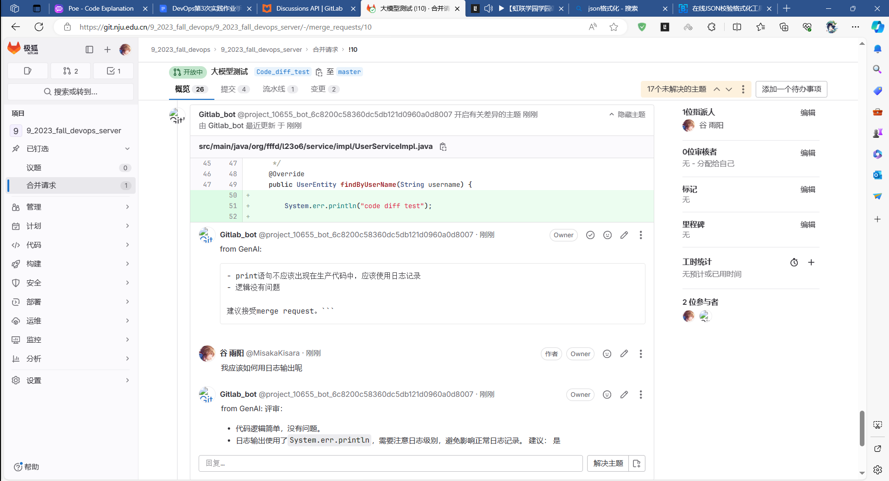

# 2023秋DevOps课程第3次实践作业报告

<center>第9组 LoveDevOps</center>


| 角色  | 姓名 | 学号 | QQ号 | 职责 |
| ----- | ---- | ---- | ---- | ---- |
| 组长  |赵政杰|211250109|3239168744| 代码检查，报告书写 |
| 组员2 |谢其卓|211870187|1055069518| 部署webhook，报告书写 |
| 组员3 |陈盛  |211250104|749810747| 编写代码访问大模型 |
| 组员4 |谷雨阳|211250108|1198890085|编写代码与大模型讨论 |

## Code Review

使用了助教部署的大模型

## 承载平台

webhook部署在**南软云**


## 通用部分

### 实现Merge Request Hook ==8/8分==

#### 截图与链接


#### 关键代码展示

```python
from fastapi import FastAPI,Request

app = FastAPI()

# 发起merge和comment时的webhook
@app.post("/webhook")
async def receive_webhook(request: Request):
    data = await request.json()

    print("Received webhook data:")
    print(data)

    if data["object_kind"] == 'merge_request':
        # 实现 merge_request 相关操作的代码
        pass

    if data["object_kind"] == 'note':
        # 实现 note 相关操作的代码
        pass

    return {"status": "ok"}
```

### Code diff对应函数提取与PR规模限制 *代码检查* ==16/16分==

#### 截图与链接


Gitlab_bot关闭的MR：https://git.nju.edu.cn/9_2023_fall_devops/9_2023_fall_devops_server/-/merge_requests/9

#### 关键代码展示

```python
if data["object_kind"] == 'merge_request':
    # 实现 merge_request 相关操作的代码
    project_id = data["project"]["id"]
    merge_request_iid = data["object_attributes"]["iid"]
    print("project_id: " + str(project_id))
    print("merge_request_iid: " + str(merge_request_iid))
    diffs = api_merge_diff(project_id, merge_request_iid)
    length = 0
    for diff in diffs:
        file_path = diff["old_path"]
        # 过滤非 java 文件的 diff
        if get_suffix(file_path) != '.java':
            continue
        file_diff = diff["diff"]
        # single_diffs = get_single_diff(file_diff)   # 分离file-diff至多个single-diff
        version = api_get_source_branch(project_id, merge_request_iid)
        # temp_file_path = get_gitlab_file_content(project_id, file_path, version)    # 获取发生改变的文件的全部内容并生成临时文件保存服务器
        # get_new_func调用了get_single_diff和get_gitlab_file_content
        funcs = get_new_func(project_id, version, file_diff, file_path)  # 获取新增的函数
        for func in funcs:
            length += len(func[0])
        print(f'length: {length}')
        # 单次PR涉及的函数代码的字节数不应超过8192
        if length > 8192:
            comment_merge_request(project_id, merge_request_iid, "单次PR涉及的函数代码的过多")
            close_merge_request(project_id, merge_request_iid)
            return {"status": "ok"}
```

### 实现对大模型的访问 *代码检查* ==16/16分==

#### 截图与链接


#### 关键代码展示

```python
for item in diff_list:
    content = ('请你用简要的中文语言评审以下代码，如果存在问题，给出具体的问题描述（注意不能是格式化或增加注释这类无意义的话）和解决方案。'
              + '用Markdown格式返回，并在最后建议是否接受这次merge request'
              + '（注意仅回答一个字“是”或者“否”并保证这是整片回答的最后一个字）\n'
              + '```待评审函数开始' + item[0] + '```待评审函数结束')
    rs = api_AI_post(content)
    # 处理异常
    if rs is None:
        comment_merge_request(project_id, merge_request_iid, "from GenAI: 大模型评审失败")
        close_merge_request(project_id, merge_request_iid)
        return {"status": "ok"}
```

###  构建符合任务需要的prompt ==24/24分==

#### 截图与链接


#### 关键代码展示

```python
for item in diff_list:
    content = ('请你用简要的中文语言评审以下代码，如果存在问题，给出具体的问题描述（注意不能是格式化或增加注释这类无意义的话）和解决方案。'
              + '用Markdown格式返回，并在最后建议是否接受这次merge request'
              + '（注意仅回答一个字“是”或者“否”并保证这是整片回答的最后一个字）\n'
              + '```待评审函数开始' + item[0] + '```待评审函数结束')
    rs = api_AI_post(content)
```

### 将大模型结果返回到Merge Request页面 ==8/8分==

#### 截图与链接


#### 关键代码展示

```python
# 调用大模型
sha = api_get_sha(project_id, merge_request_iid)
print("AI评审中...")
for item in diff_list:
    content = ('请你用简要的中文语言评审以下代码，如果存在问题，给出具体的问题描述（注意不能是格式化或增加注释这类无意义的话）和解决方案。'
              + '用Markdown格式返回，并在最后建议是否接受这次merge request'
              + '（注意仅回答一个字“是”或者“否”并保证这是整片回答的最后一个字）\n'
              + '```待评审函数开始' + item[0] + '```待评审函数结束')
    rs = api_AI_post(content)
    # 处理异常
    if rs is None:
        comment_merge_request(project_id, merge_request_iid, "from GenAI: 大模型评审失败")
        close_merge_request(project_id, merge_request_iid)
        return {"status": "ok"}
    # 推送到评论区
    flag = get_diffNote_postion(item[1])
    tmp = api_post_diffNote(project_id, merge_request_iid, sha.get("base_commit_sha"), sha.get("head_commit_sha"),
                            sha.get("start_commit_sha"), new_path, old_path, flag[0] if flag[1] == 1 else None,
                            flag[0] if flag[1] == 0 else None, 'from GenAI: \n' + rs)
    print(rs)
```

## ==Code Review 方向==

### 大模型判断是否接受PR ==16/16分==

#### 截图与链接


根据大模型建议关闭的MR：https://git.nju.edu.cn/9_2023_fall_devops/9_2023_fall_devops_server/-/merge_requests/10

#### 关键代码展示

```python
# 调用大模型
sha = api_get_sha(project_id, merge_request_iid)
print("AI评审中...")
close = False
for item in diff_list:
    content = ('请你用简要的中文语言评审以下代码，如果存在问题，给出具体的问题描述（注意不能是格式化或增加注释这类无意义的话）和解决方案。'
              + '用Markdown格式返回，并在最后建议是否接受这次merge request'
              + '（注意仅回答一个字“是”或者“否”并保证这是整片回答的最后一个字）\n'
              + '```待评审函数开始' + item[0] + '```待评审函数结束')
    rs = api_AI_post(content)
    # 处理异常
    if rs is None:
        comment_merge_request(project_id, merge_request_iid, "from GenAI: 大模型评审失败")
        close_merge_request(project_id, merge_request_iid)
        return {"status": "ok"}
    # 推送到评论区
    flag = get_diffNote_postion(item[1])
    tmp = api_post_diffNote(project_id, merge_request_iid, sha.get("base_commit_sha"),
                            sha.get("head_commit_sha"),
                            sha.get("start_commit_sha"), new_path, old_path,
                            flag[0] if flag[1] == 1 else None,
                            flag[0] if flag[1] == 0 else None, 'from GenAI: \n' + rs)
    # 提取AI的建议
    if rs[-1] == '否':
        close = True
    print(rs)
if close:
    comment_merge_request(project_id, merge_request_iid, "大模型建议拒绝这次merge request")
    close_merge_request(project_id, merge_request_iid)
else:
    comment_merge_request(project_id, merge_request_iid, "大模型建议接受这次merge request")
    reopen_merge_request(project_id, merge_request_iid)
```

### 与大模型讨论PR ==12/12分==

#### 截图与链接



与大模型讨论的MR：https://git.nju.edu.cn/9_2023_fall_devops/9_2023_fall_devops_server/-/merge_requests/10

#### 关键代码展示

```python
# 调用大模型是将变更加入缓存
set_list(json.loads(tmp).get("id"), content)

...

if data["object_kind"] == 'note':
    # 实现 note 相关操作的代码
    project_id = data["project_id"]
    merge_request_iid = data["merge_request"]["iid"]
    discussion_id = data["object_attributes"]["discussion_id"]
    description = data["object_attributes"]["description"]
    if match_string(description) == 1:  # 过滤AI的回复
        print("Received note from AI")
        return {"status": "ok"}
    post_discussion_note(project_id, merge_request_iid, discussion_id, description)
```

## 总结与感想

大模型理解代码的能力暂时比较薄弱，且不能从整体项目的角度出发。未来大模型的迅猛发展，这些问题得以解决，将为软件行业带来巨大变革。

