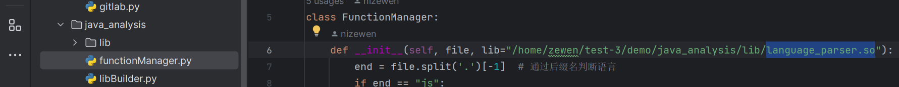
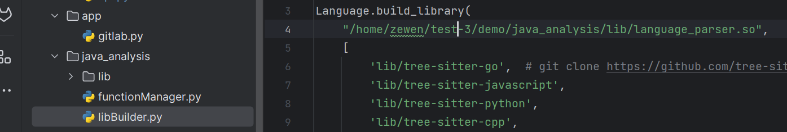

## gitlab-robot的测试demo

> 时间紧促这里的demo仅能判断来自已有文件已有函数内的更改，对于新增文件/删除文件/新增函数/删除函数的情况需要覆写新逻辑(不一定要实现)

此demo已经已经实现：
- webhook接收gitlab的merge_request、diffNote和后续对于diffNote的评论
- 分离单个diff,提取函数并去重
- GenAI评审函数，建立提问缓存以保存对话上下文
- 提交diffNote到merge评论页对应的行位置，对于多个diff在同一个函数里的情况仅推送到函数内最后一个diff的最后一行所在位置
- 提交评论至已经有的diffNote
- GenAI评审内容写入文件并推送至指定仓库

还没实现的/可能要解决的问题：
- 并行访问GenAI是否需要线程池+异步任务以提升性能？
- 关于diffNote对应行的推送位置可能不准确，或许可以使用推送多行的方式但官方文档参数没有写清楚(也可能是我看漏了)测试未成功
- 可能会有没有测试出来的bug
- 异常处理
- PR规模限制

如何部署：
- gitlab 添加webhook，webhook路径为 ``{ip}:8000``
- 在 ``api/api.py`` 中修改 ``token`` 为自己的
- ``/gitlab/gitlab.py`` 和 api_commit_post
- 在压缩包目录解压python包并输入 ``cd demo`` 进入python包根目录
  - 输入``pwd``查看python包根目录为 ``{包的根目录}``
    - 更改 ``java_analysis/functionManager.py``和``java_analysis/libBuilder.py``中 ``language_parser.so`` 的 ``绝对路径`` 位置，同样可以使用上面的``pwd``查看路径，若路径中出现 ``~``，请使用 ``root`` 代替
      - 
      - 
  - 添加python路径 ``export PYTHONPATH=$PYTHONPATH:{包的根目录}``
- 安装需要的python包
  - ``pip3 install fastapi``
  - ``pip3 install tree_sitter``
  - ``pip3 install uvicorn==0.16.0``
- 在 ``{包的根目录}/app/`` 路径下开启服务器 ``pip3 -m uvicorn gitlab:app --host 0.0.0.0 --port 8000``
  - 若报错依赖缺失，请根据报错信息安装相应python包
  - 若无异常则服务器将在``8000``端口启动

关于关闭merge
- 逻辑没有写
- api已测试可行